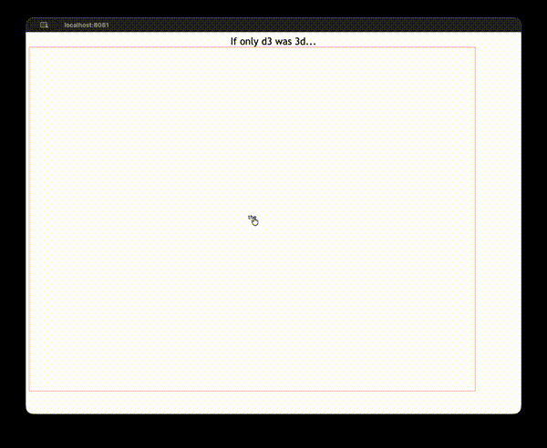

# Spiral Poetry

An interactive generative poetry visualization from 2013. A Markov chain trained on Chaucer's *Canterbury Tales* produces word-by-word text, rendered as a force-directed graph that spirals outward in real time.



Click any word to start a chain reaction: each new word is sampled from the Markov model's transition probabilities, added as a connected node, and pushed outward by D3's physics simulation. The result is a branching, spiraling tree of pseudo-Chaucerian text that grows continuously across the screen.

## How it works

1. **`mashup.py`** reads one or more source texts, tokenizes them into words, and builds a first-order Markov chain — a probability distribution over which word follows which. The distributions are normalized across sources so multiple texts can be blended together. Output is a JSON lookup table mapping each word to its possible successors and cumulative probabilities.

2. **`www/index.html`** loads that JSON and renders an interactive D3.js force-directed graph. Clicking a word node triggers a recursive `play()` loop: sample the next word, add it as a new node with a linking edge, wait a random interval (0-600ms), and repeat. The force layout continuously repositions nodes, creating an organic spiral as the text grows.

3. **`server.py`** serves the static frontend via CherryPy.

The Markov engine is general-purpose — it supports both character-level and word-level tokenization, and can mash up arbitrary source texts (Shakespeare's sonnets, song lyrics, its own source code).

## Running locally

```bash
uv run python mashup.py ct-norm.txt                # build the Markov model
cp data.json www/data/data.json                     # place it where the frontend expects it
cd www && python3 -m http.server 8080               # serve at http://localhost:8080
```

## License

MIT
